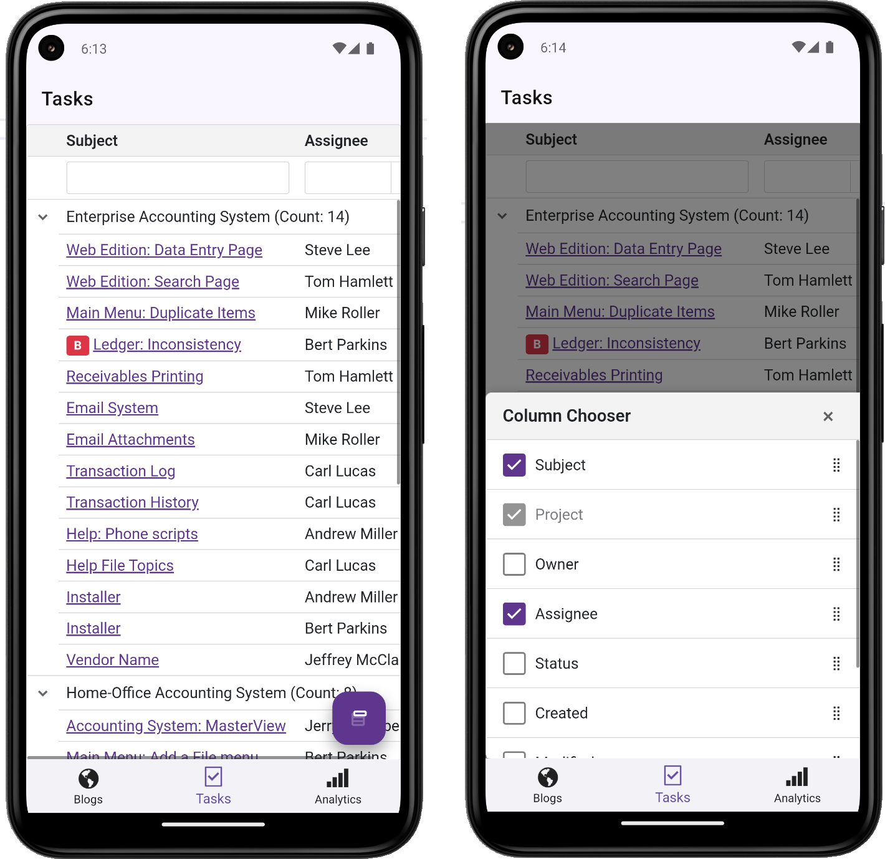
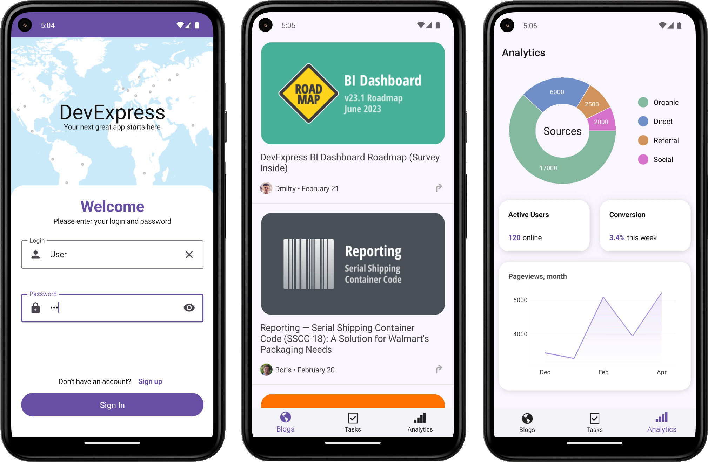

<!-- default badges list -->

<!-- default badges end -->

# Use DevExpress MAUI and Blazor Components to Create a .NET MAUI Blazor Hybrid app

This demo example shows how to utilize DevExpress Blazor and .NET MAUI components to develop a .NET MAUI Blazor Hybrid app. 

## Blazor Hybrid View

This page uses the DevExpress Blazor Grid to display a list of tasks. When the app is viewed on smaller screen sizes, adaptive triggers reduce the number of columns and display a column chooser button. 

The code for this view is shared between MAUI and Blazor Server apps. The MAUI version uses a larger size mode.

**Files to look at:** [HybridGridPage.xaml](./BlazorDemo.MAUI/MauiViews/HybridGridPage.xaml), [MauiProgram.cs](./BlazorDemo.MAUI/MauiProgram.cs), [GridList.razor](./BlazorDemo.Shared/Components/GridList.razor)

**Read more:** [Blazor Size Modes](https://docs.devexpress.com/Blazor/401784/common-concepts/customize-appearance/size-modes), [Adaptive Layout API](https://docs.devexpress.com/Blazor/DevExpress.Blazor.DxLayoutBreakpoint)

## Views Built with MAUI

### Login View

This page shows how to implement a login UI in your .NET MAUI application.

**Available user:** "User" with the password "123".

**File to look at:** [LoginPage.xaml](BlazorDemo.MAUI/MauiViews/LoginPage.xaml)

**Read more:** [Authentication](https://docs.devexpress.com/MAUI/404307/scenarios/authenticate)

### Blogs View

This page uses our [DXCollectionView](https://docs.devexpress.com/MAUI/DevExpress.Maui.CollectionView.DXCollectionView?p=netframework) component to show a collection of items. Note the infinite scrolling feature - the component loads batches of items on demand.

**File to look at:** [BlogsPage.xaml](BlazorDemo.MAUI/MauiViews/BlogsPage.xaml)

**Read more:** [Infinite Scrolling](https://docs.devexpress.com/MAUI/404358/scenarios/infinite-grid-scroll)

### Analytics View

This page shows how to use our [SimpleButton](https://docs.devexpress.com/MAUI/DevExpress.Maui.Controls.SimpleButton) components to create clickable cards.

**File to look at:** [AnalyticsPage.xaml](BlazorDemo.MAUI/MauiViews/AnalyticsPage.xaml)

**Read more:** [Cards with Custom Content](https://docs.devexpress.com/MAUI/404341/scenarios/buttons-and-charts-in-cards)

## Documentation

* [Build a .NET MAUI Blazor Hybrid app](https://learn.microsoft.com/en-us/aspnet/core/blazor/hybrid/tutorials/maui?view=aspnetcore-7.0&pivots=windows)
